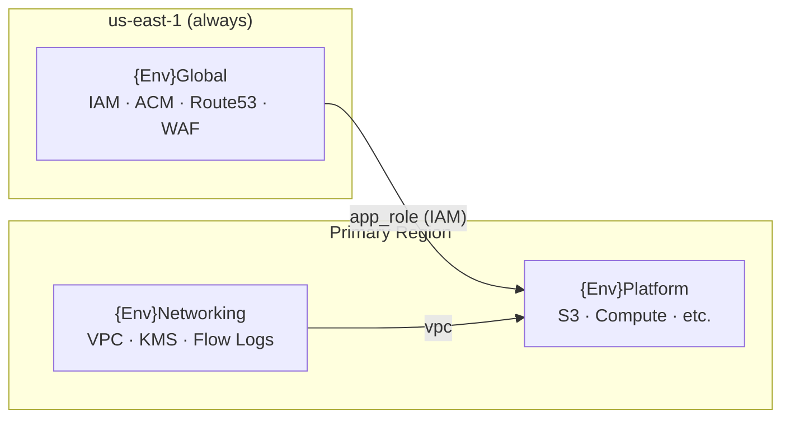

# Architecture Overview

## Stack Model

Every `CDK_ENV` produces three stacks that deploy in order:



`GlobalStack` hardcodes `region=us-east-1` inside its constructor — it **cannot** be accidentally deployed elsewhere even if you pass a different region in `CDK_ENV`.

## Layer Responsibilities

### `infra/config/accounts.py`

Single source of truth for all environment differences. Two dataclasses drive all stack behaviour:

- `AccountConfig` — account ID, region, AWS CLI profile name
- `EnvironmentConfig` — VPC CIDR, feature flags (`enable_flow_logs`, `enable_cloudtrail`), removal policy, tags

All stacks receive `env_config: EnvironmentConfig` and read from it rather than hardcoding anything.

### `infra/constructs/`

Reusable L3 constructs. Each construct is self-contained and can be unit-tested independently. Stacks compose constructs — constructs never import from stacks.

| Construct | What it creates |
|-----------|----------------|
| `EnterpriseVpc` | 3-tier VPC (public/private/isolated), 3 AZs, 1 NAT GW, optional flow logs |
| `EnterpriseKmsKey` | CMK with auto-rotation, retain policy, alias |

### `infra/stacks/`

Stacks own CloudFormation stack boundaries and `CfnOutput` exports. They receive dependencies as constructor parameters — no stack imports from another stack's internals directly.

## Cross-Stack Reference Pattern

CDK cross-stack references (CloudFormation exports/imports) couple stacks tightly and block independent deployments. This project avoids them by **passing objects as constructor parameters**:

```python
# app.py — objects flow downward, never via CFN exports
global_stack  = GlobalStack(...)
networking    = NetworkingStack(...)
PlatformStack(..., vpc=networking.vpc, app_role=global_stack.app_role)
```

`CfnOutput` exports are retained for observability (e.g. looking up the VPC ID in the console) but are not consumed by other stacks at synth time.

## Deployment Order

CDK resolves the dependency graph automatically from constructor parameters. The implicit order is:

1. `{Env}Global` — IAM roles needed by platform resources
2. `{Env}Networking` — VPC needed by platform resources  
3. `{Env}Platform` — consumes outputs from both above

To deploy a single stack:

```bash
CDK_ENV=dev uv run cdk deploy DevNetworking --profile dev
```
