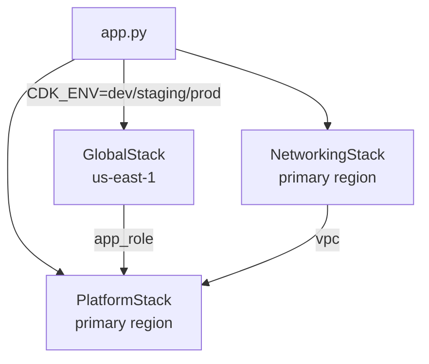

# CDK Enterprise Platform

Enterprise-grade AWS infrastructure defined in Python using AWS CDK. Supports multi-account deployments across `dev`, `staging`, and `prod` with a clean separation between global and regional resources.

## Key Principles

- **One CDK app, many accounts** — the `CDK_ENV` environment variable selects the target account at synth/deploy time.
- **Global vs Regional** — IAM, ACM, Route53, and WAF always land in `us-east-1` via `GlobalStack`. All other stacks deploy to the account's configured primary region.
- **No long-lived credentials** — GitHub Actions authenticates via OIDC; the trust is managed by `CiDeployRole` in `GlobalStack`.
- **uv for dependency management** — a single `pyproject.toml` with locked dependencies via `uv.lock`.

## Stack Topology

## Quick Links

- [Getting Started](getting-started.md) — first-time setup and local workflow
- [Adding a New Resource](guides/new-resource.md) — step-by-step with examples
- [Architecture Overview](architecture.md) — how stacks relate to each other
- [Environment Configuration](reference/environments.md) — account IDs, CIDRs, feature flags